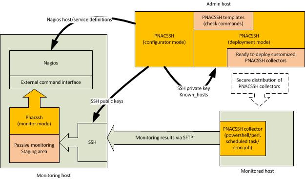

# pnacssh - Passive Nagios Core checks via SSH

Pnacssh is a versatile tool to set up secure passive monitoring via ssh with a few steps. As widely known, passive checks are a convenient way to gather monitoring information from hosts which somehow are not available for active checks, and SSH offers a well proven framework for secure communications. Pnacssh has following features:

* Based on monitoring templates (basic checks for Linux and Windows are included, easily extendable)
* Create Nagios host and service definitions for the selected host and template
* Create SSH keys
* Configure SSH for secure communications
* Create host-specific sftp setup for bulk transfers of monitoring results
* Customize data collector scripts (Perl/Powershell) according to templates
* Generate host-specific data collectors which can be run periodically (cron/scheduled task)
* Monitoring incoming check results and feed them to Nagios via external command interface

As described above, Pnacssh is capable to automate all steps involved in secure passive monitoring. All this functionaliy is available as a small perl script and a set of templates, making deployment and further customization an easy task.
